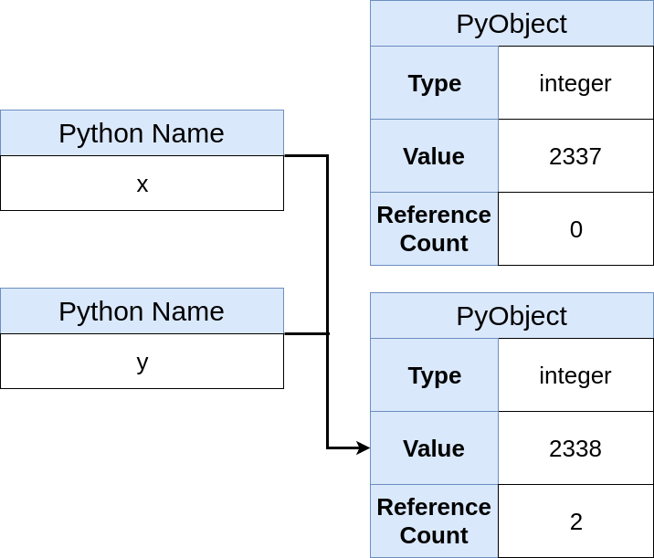

# Python 3 Data Structures Crash Course

Author: methylDragon  
Contains a reference of commonly used data structures in Python 3      

------

## Pre-Requisites

### Assumed knowledge 

- Gone through the all preceding parts of the tutorial


### Good to know

- We're using Python 3 here! Python 2 has different syntax!
- If you have knowledge of computation structures like variables, functions, OOP, etc. it'll be easier
- But if not... https://www.youtube.com/playlist?list=PLGLfVvz_LVvTn3cK5e6LjhgGiSeVlIRwt
  - Or you can learn on the go!
- Having a rough understanding of data structures is nice too


## Table Of Contents


## Introduction

Data structures are a core computer science topic that allows one to effectively organise and manage data for efficient access and modification. Python has a couple of nice implementations of many common data structures, and we'll go through them, as well as their relevant Python implementations in this tutorial!


## Python Data Structures Reference

### The Python Data Model

> *Objects* are Python’s abstraction for data. All data in a Python program is represented by objects or by relations between objects. (In a sense, and in conformance to Von Neumann’s model of a “stored program computer,” code is also represented by objects.)
>
> Every object has an identity, a type and a value. An object’s *identity* never changes once it has been created; you may think of it as the object’s address in memory. The ‘[`is`](https://docs.python.org/3/reference/expressions.html#is)’ operator compares the identity of two objects; the[`id()`](https://docs.python.org/3/library/functions.html#id) function returns an integer representing its identity.
>
> <https://docs.python.org/3/reference/datamodel.html>

Everything in Python is fundamentally an object. It's part of what makes working with data in Python so easy (albeit with some overhead.)

#### **Names, References, and Objects**


[Image Source](<https://www.slideshare.net/nnja/memory-management-in-python-the-basics>)

When you do something like this:

```python
x = 300
y = 300
```

You're actually creating **names** that **reference** a single integer **object** the contains the value 300. In this case different names can bind to the same object because the `integer` type is fundamentally immutable.

If you did this however,

```python
x = [1]
y = [1]
```

Lists are mutable, so the names will reference separate objects.

#### **Python Objects, Reference Counts, and Garbage Collection**


[Image Source](<https://realpython.com/pointers-in-python/>)

So every time you create a variable (hence creating a name that references a Python object), the Python object that is created or referenced to will have its **reference count** increased by 1. The PyObject also contains information about the object's type and its value. This is how types are resolved in Python!

**Python tracks how many references an object has!** Once that count hits 0, it is slated for deletion by Python's automatic garbage collector and freed from memory. This all happens in the background, and is also the reason why Python is so slow.

So now suppose we rebind x to a different value instead.

```python
x = 2338
y = 2338
```



[Image Source](<https://realpython.com/pointers-in-python/>)

You can see that 2337's refcount is decreased (to 0, which means it will be garbage collected eventually), and x and y now point to the PyObject for 2338, which now has a reference count of 2.

Pretty nifty eh!


```
                            .     .
                         .  |\-^-/|  .    
                        /| } O.=.O { |\     
```

​    

------

 [.png)](https://www.buymeacoffee.com/methylDragon)